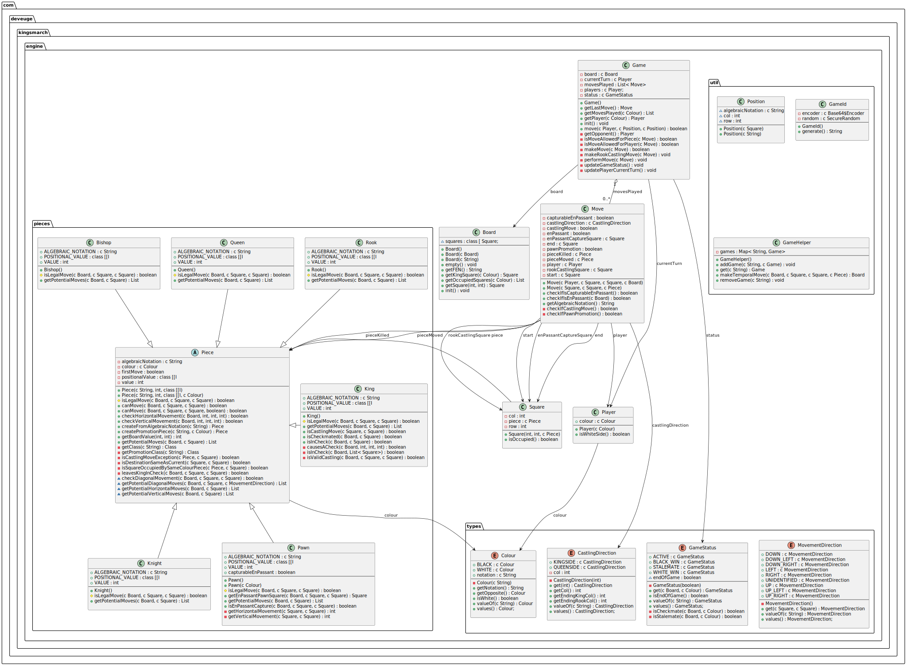

# Kingsmarch

_Spring Boot App  - Single and multiplayer chess web game_

Please note that because Render is a free Cloud Application Platform, load times can be somewhat high and have nothing to do with the application itself.

## Features
* Chess logic
    * Contains all the basic moves of the pieces.
    * En passant capture.
    * Castling
    * Pawn promotion.
    * Control of check, checkmate and stalemate.
* Single player game
    * Simple AI which includes the calculation of the next move using:
        * Minimax algorithm.
        * Alpha-beta pruning.
        * Board evaluation based on the individual value of each piece and its position on the board.
        * Opening book movements.
* Multiplayer game
    * Allows playing from any device by sharing a link to the game.
    * As long as one player remains in the game, it will remain open and the other player can reconnect without losing progress.
* Visual customisations
    * Allows you to change the visual appearance of the pieces, the colour of the board and the position of the notation.
    * These preferences are saved in the player's browser.

## Technical aspects
The aim of this project is to show my programming logic in relation to object-oriented programming.
It is because of this, together with the performance of the Render.com server itself, that the generation times of the next move of the single-player game AI is slow. It is acknowledged that there are other implementations that involve much more efficient solutions such as representing moves as integers and using bitwise operations to represent move-from, move-to and move-type, as ceating objects in Java is relatively inefficient.

### Frontend
* Responsive design. No additional libraries are used as they are considered unnecessary in a simple design that can be achieved with CSS flex and grid.
* Use of CSS variables, animations and transitions to bring the design to life and make it more professional.
* Use of the [**chessboard.js**](https://chessboardjs.com/) library for the visual representation of the board.
* Use of websockets for communication in multiplayer games.

### Backend
* Use of Spring Boot. The initial project was generated with Spring Initializr with the following modules:
	* Spring Boot Web
	* Spring Boot Thymeleaf
	* Spring Boot Websocket
	* Spring Boot Devtools
	* Lombok
* For simplicity, no external databases are used.
	* For single player games, the game is stored in session.
	* For multiplayer games, the game is stored in an object in memory. This object is kept as long as at least one of the two players remains connected to the game and is deleted when both players have disconnected from the websocket.
* The simplified entity model is as follows:

## Future improvements
The project can be improved on several points:
* Adding end-of-game rules:
	* Threefold repetition
	* 50 move rule
* Add full FEN notation support.
	* Currently, for both single and multiplayer games, it is possible to access an already started game by adding "?fen={FEN_NOTATION}" to the URL.
	* This notation should only contain the piece placement data, because this is the only thing Kingsmarch interprets at the moment. This is why values such as which player's turn is next, castling data or previous piece movement are not taken into account.
* Use of database:
	* Once the FEN notation is fully implemented, game saving and retrieval could be done in non-relational databases instead of in-memory or session.
* Add API to query legal moves from a FEN notation.
	* In this way, other external applications could benefit from the logic developed for Kingsmarch.
* Improve the AI logic
	* Improve the calculation of the next move.
	* Improve the opening book. Currently it contains only 77 records.
	* Improve pawn promotion. Currently the AI always promotes to Queen for simplicity.